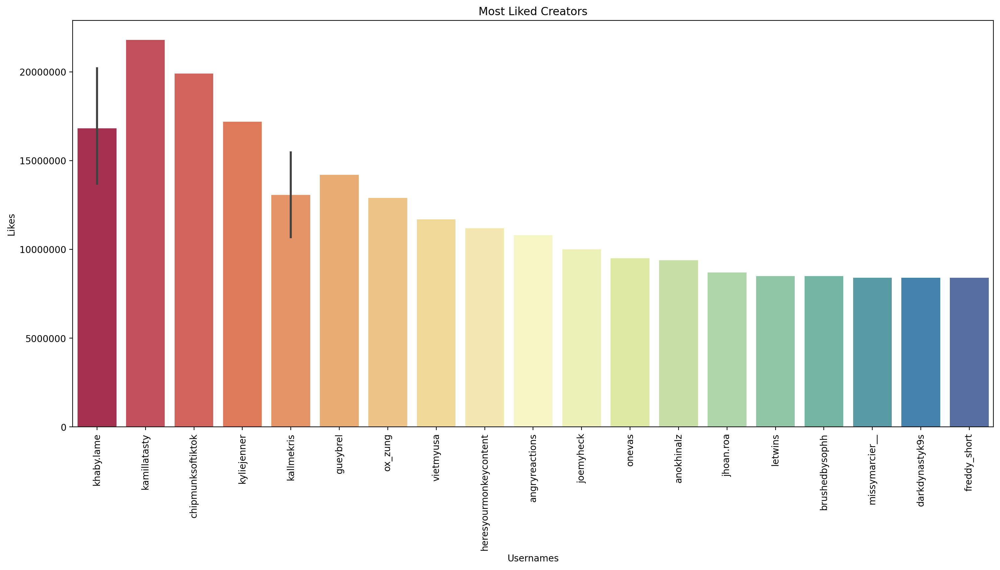
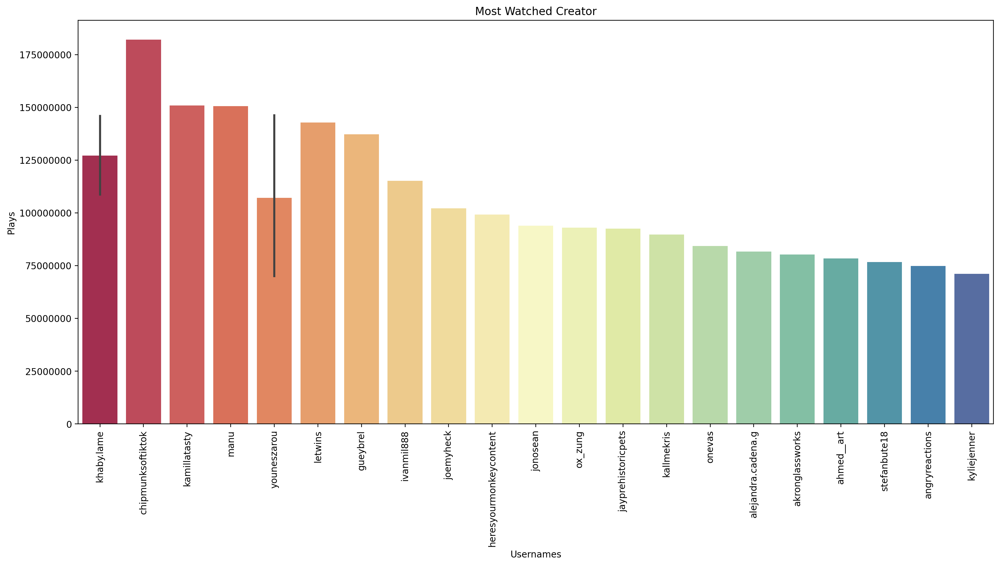
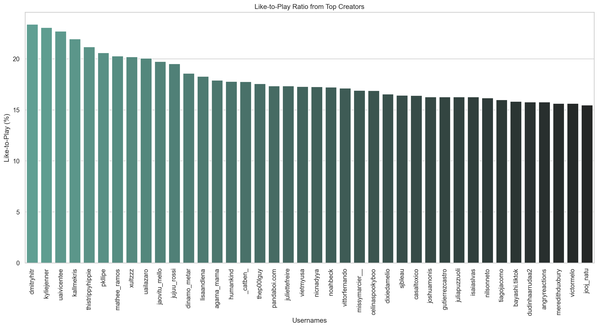
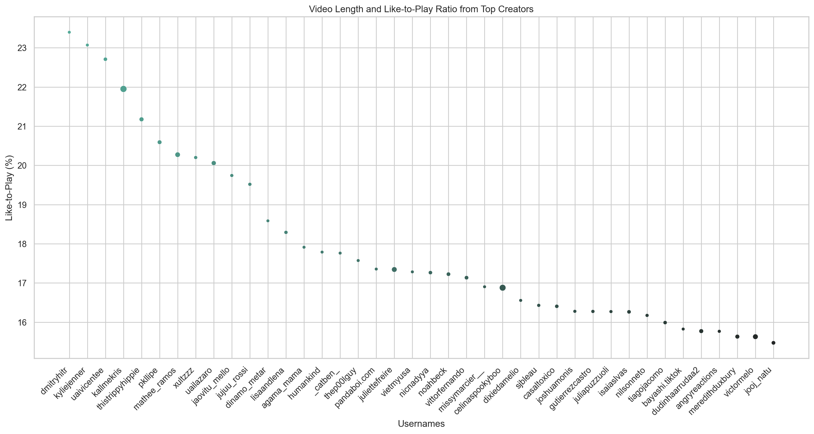
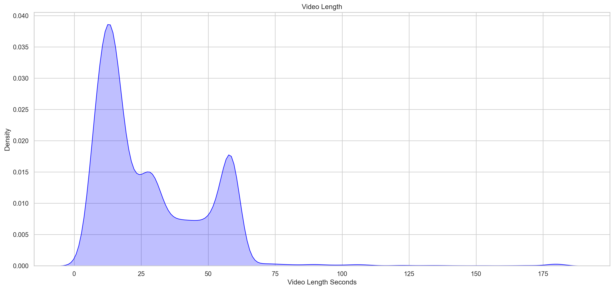
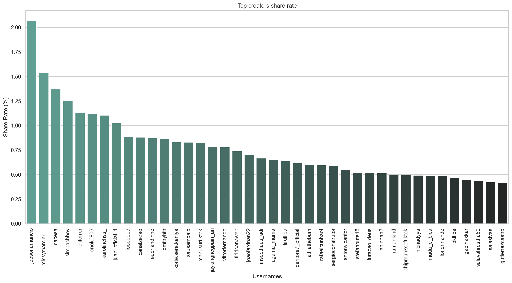

# Resumo
## Introdução 
Neste breve projeto, tive a oportunidade de analisar os vídeos mais populares no TikTok brasileiro em maio de 2021. Usei principalmente Python com Numpy para análise estatística e uso otimizado de memória, pois se trata de um grande conjunto de dados com muitas colunas e linhas, Jupyter como opção de notebook, Pandas e Seaborn para visualização limpa de dados.

## Objetivos 
Trabalhar com um conjunto de dados que se concentra em mídia social (curtidas, comentários, compartilhamentos e reproduções) me levou às seguintes perguntas:

    1. Quais usuários são os mais populares? 
    2. Quais são as tendências no momento?  
    3. Há um determinado tamanho de conteúdo que tende a gerar mais engajamento?
    4. Qual conteúdo tem boa capacidade de compartilhamento?

Se eu puder responder essas cinco perguntas, insights úteis seriam criados.

## Problemas
Tive alguns problemas com tipos de dados, pois alguns campos que eram números foram reconhecidos como tipos de objetos (strings). Como de costume, havia campos NaN, campos vazios, que foram devidamente limpos e corrigidos antes da análise. 

## Análise
### 1. Conclusão 
Em maio de 2021, todos os principais usuários mais populares tinham conteúdo sobre os seguintes tópicos: reações, muitas vezes misturadas com humor, animais fofos, conteúdo relacionado a alimentos, comédia geral para todas as idades. Todos eles tinham durações de vídeo variadas, mesmo entre usuários que produziam o mesmo tipo de conteúdo, sem correlação direta com o engajamento. O conteúdo negligenciado que tinha bons números em geral (curtidas, compartilhamentos etc.), boa conversão de reproduções em engajamento e uma alta taxa de compartilhamento era de longe: receitas culinárias _e animais fofos, mas esse não é realmente um tipo de conteúdo negligenciado_.

Muitos dos principais criadores de conteúdo não convertem bem em compartilhamentos porque suas contas são grandes o suficiente para atingir milhões, se não bilhões, de pessoas, o que, por si só, é atraente para os patrocinadores (Khaby Lame, por exemplo). No entanto, se observarmos com atenção, veremos que alguns criadores de conteúdo menores (300 mil a 5 milhões de seguidores) têm taxas de compartilhamento e engajamento impressionantes com o público, o que também pode levar a vendas para patrocinadores e/ou produtos do próprio do criador.

Tangente: A mudança no conteúdo popular de 2021 para 2024 é impressionante. Parece que hoje em dia todo mundo já se deparou com vídeos de tela dividida do Subway Surfer e Minecraft Parkour. Agora, o foco não está apenas no que você está assistindo; ele se estende também ao que você está ouvindo. Isso indica uma inclinação crescente para experiências multissensoriais. O conteúdo padrão perdeu seu apelo e as pessoas estão buscando formas mais envolventes e imersivas de entretenimento que estimulem não apenas visualmente, mas também por meio de experiências de áudio envolventes (Reddit Narration, por exemplo).
### 1.1 O que as pessoas consomem?

Considerando que o número médio de curtidas é de cerca de 400.000, esses são criadores que estão muito acima da média. Podemos ver claramente que o número 1 é **Khaby Lame**, que é famoso por suas reações cômicas, e os outros 2 que vêm em seguida são, respectivamente, conteúdo relacionado a alimentos e _animais fofos_. No entanto, isso não é suficiente para tirar conclusões definitivas sobre o que realmente é tendência. Vamos dar uma olhada em alguns outros números.    

Está seguindo a tendência: Reações, comida, animais fofos. Vale a pena observar que há algumas exceções aqui. Veja **Kylie Jenner**, que tem um dos maiores números de curtidas, mas um dos menores números de reproduções entre os principais criadores. O mesmo acontece com **Won Jeong** (ox_zung), portanto, é seguro presumir que o conteúdo de celebridades tem mais engajamento do que a maioria dos outros tipos de conteúdo.

### 1.2 O que as pessoas engajam?

Para criar esse número, fiz este cálculo simples (* 100 para obter uma porcentagem):

Temos uma grande variedade de criadores de conteúdo aqui, e você perceberá que quase nenhum dos criadores com mais curtidas está representado. Isso ocorre porque é difícil para contas realmente grandes obterem uma proporção alta o suficiente, simplesmente porque são grandes. Você não esperaria que uma conta com 100 milhões de seguidores tivesse uma taxa insana de 20% de curtidas. Uma comparação entre **Khaby Lame** e **Kylie Jenner** (ou mesmo **Won Jeong**) mostra que o conteúdo de celebridades realmente faz com que as pessoas engajem, comentem e curtam. Por outro lado, o conteúdo de comédia pode obter uma porcentagem menor (em relação ao conteúdo de celebridades) e ainda assim estar acima da média. A imbatível categoria _animais fofos_ foi incluída em todos os números apresentados anteriormente. Desta vez não foi diferente, pois o usuário com a maior taxa de curtidas é **dmitryhitr**, o que só prova que _animais fofos_ evocam essa resposta empática de todo mundo, independentemente do idioma que falam. Agora vamos verificar se há uma correlação entre a duração do vídeo e a taxa de curtidas.

 

Nessa figura, o tamanho dos pontos indica a duração do vídeo. Não há uma correlação clara, a única conclusão que podemos tirar é: vídeos curtos são significativamente mais comuns do que os mais longos. E isso se torna factual, especialmente se combinado com esta outra figura:

 

### 1.3 O que as pessoas compartilham? 

 

A tendência mencionada acima se repete: receitas culinárias, animais fofos e comédia, mas, desta vez, todo o humor de comédia é voltado para um público mais jovem (12 a 16 anos) ou mais velho (mais de 35 anos), pois parte do humor é satírico e parte tem duplo sentido, respectivamente.

## Apêndice

Durante essa análise, tive que ver o perfil de cada Tiktoker para criar uma análise melhor e mais descritiva. Isso poderia ter sido resolvido com um modelo de classificação de ML para descrever o tipo de conteúdo, mas o conjunto de dados em si não daria suporte a isso, pois não havia muito mais além das informações usadas.

## Autores
Lucas Tavares
- [Linkedin](https://www.linkedin.com/in/lucas-tavares-4a40851b1/)

## Referências

 - [Brazillian Tiktok Trending Videos](https://www.kaggle.com/datasets/ilanbrik/brazilian-tiktok-trending-videos)
 - [Análise de Ilan Brik](https://www.kaggle.com/code/ilanbrik/tiktok-trends-in-brazil)

