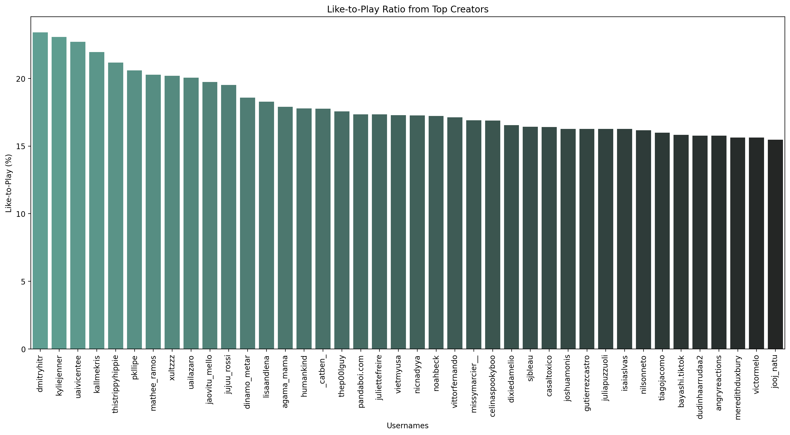

# Summary
## Introduction 
In this short project, I had the opportunity to analyse the trending videos on the Brazilian TikTok in May 2021. I mainly used Python with Numpy for statistical analysis and optimized memory usage as it's a large dataset with many columns and rows, Jupyter as notebook option, Pandas and Seaborn for clean data visualization.

## Goals 
Working with a dataset that focuses on social media (likes, comments, shares and plays) has led me to the following questions:

    1. Which users are the most popular? 
    2. What's trending right now?  
    3. Is there a certain length of content that tends to lead to more engagement?
    4. What content has good shareability?

If i could answer these five questions, there would be useful insights.

## Problems
I had some problems with data types, as some fields that were numbers were recognized as object dtypes (strings). As usual, there were NaN fields, empty fields, which were properly cleaned up and corrected before analysis. 

## Analysis
### 1. Conclusion 
In May 2021, all top trending users had content on the following topics: reactions, often mixed with humor, cute animals, food-related content, general comedy for all ages. They all had varying video lengths, even among users who produced the same type of content, with no direct correlation to engagement. The overlooked content that had good numbers all around (likes, shares, etc.), good conversion from plays to engagement, and a high share rate were by far the best: cooking recipes _and cute animals, but that's not really an overlooked content type_.

Many of the top content creators don't convert well into shares because their accounts are large enough to reach millions, if not billions, of people, which in itself is attractive to sponsors (Khaby Lame, for example). However, if we look closely, we can see that some smaller content creators (300K - 5M followers) have impressive share rates and engagement with the audience in general, which could lead too, to sales for sponsors and/or products owned by the creator.

Tangent: The shift in popular content from 2021 to 2024 is striking. It seems like nowdays everyone has already come across Subway Surfer and Minecraft Parkour split-screen videos. Now, the focus isn't just on what you're watching; it extends to what you're listening to as well. It hints at a growing inclination towards multi-sensory experiences. Standard content has lost its appeal and people are looking for more engaging and immersive forms of entertainment that stimulate not only visually but also through engaging audio experiences (Reddit Narration, to name a few).
### 1.1 What people consume?

Considering that the average number of likes is around 400,000, these are creators who are way above average. We can clearly see that the number 1 is **Khaby Lame**, who is famous for his comedic reactions, and the other 2 that follow are respectively food-related content and _cute animals_. However, this is not enough to draw any definite conclusions about what is really trending. Let us take a look at some other figures.    

Looks like it's following the trend: Reactions, food, cute animals. It's worth noting that there are some outliers here. Look at **Kylie Jenner**, who has one of the highest number of likes but one of the lowest number of plays among the top creators. The same happens with **Won Jeong** (ox_zung),so it's safe to assume that celebrity content has higher engagement than most content types.

### 1.2 What people engage in?
>>>>>>> f388741d22159b7c929dd13419498fcf5c5bffc0

To build this figure i made this simple calculation (* 100 to get a porcentage):

We have a wide range of content creators here, and you'll notice that almost none of the creaters with the most likes are represented. That's because it's hard for really big accounts to get a high enough ratio, simply because they're big. You wouldn't expect an account with 100 million followers to have an insane like-to-play ratio of 20%. A comparison between **Khaby Lame** and **Kylie Jenner** (or even **Won Jeong**) shows that celebrity content really does get people to engage with it. On the other hand, comedy content can get a lower percentage (relative to celebrity content) and still be above average. The unbeaten _cute animals_ category was included in all the figures presented. This time was no different, as the user with the highest like-to-play ratio is **dmitryhitr**, which only proves that _cute animals_ evoke that empathetic response from everyone, regardless of the language they speak. Now let's look at whether there is a correlation between the length of the video and the like-to-play rate.

 

In this figure, the size of the dots indicates how long the video is. There is no clear correlation, the only conclusion we can make is: short videos are significantly more common than longer ones. And this is true, especially if paired with this other figure:

 

### 1.3 What people share? 

 

The aforementioned trend repeats itself, Cooking recipes, cute animals and comedy, but this time all the comedy humor is aimed at either a younger (12 - 16 years) or older audience (35+ years), as some of the humor is satirical and some has more double-meaning, respectively.

## Appendix

During this analysis, I had to look up each tiktoker in order to create a better, more descriptive analysis. This could have been solved with an ML classification model to describe the content type, but the dataset itself would not support this as there was not much else besides the information used.

## Authors
Lucas Tavares
- [Linkedin](https://www.linkedin.com/in/lucas-tavares-4a40851b1/)

## References

 - [Brazillian Tiktok Trending Videos](https://www.kaggle.com/datasets/ilanbrik/brazilian-tiktok-trending-videos)
 - [Ilan Brik Analysis](https://www.kaggle.com/code/ilanbrik/tiktok-trends-in-brazil)

